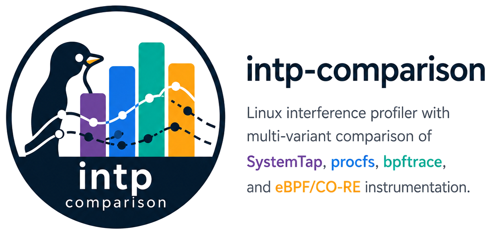

# IntP Comparison: Multi-Variant Interference Profiler



This repository contains nine implementation variants of IntP, an interference
profiler that collects 7 metrics from the Linux kernel. The variants are
organized for systematic comparison as part of a Master's dissertation on
kernel instrumentation for interference profiling (PPGCC/PUCRS, advisor
Prof. Cesar De Rose). The research compares the original SystemTap-based IntP
across kernel eras (V0 / V0.1 / V0.2), an RCU-safe stap+helper hybrid (V1.1),
and modern instrumentation approaches (procfs polling — V2; bpftrace — V3.1;
eBPF/CO-RE — V3 ring-buffer-streaming; eBPF/CO-RE — V3.2 in-kernel-aggregating)
to evaluate portability, safety, and measurement-fidelity trade-offs.

## About

**Author:** André Sacilotto Santos (PPGCC/PUCRS)
**Advisor:** Prof. Cesar De Rose
**Program:** Post-Graduate Program in Computer Science -- PPGCC, PUCRS
**Research Area:** Cloud computing performance, kernel instrumentation, interference profiling

### Background

IntP (Interference Profiler) was originally developed by Xavier et al. (2022, PUCRS)
as a SystemTap-based tool for measuring resource interference between co-located workloads
in cloud environments. It collects seven low-level metrics (network physical, network
stack, block I/O, memory bandwidth, LLC miss ratio, LLC occupancy, CPU) to characterize
how one tenant's resource usage affects another's performance.

This work extends and refactors IntP to support modern Linux kernels (6.8+) and
modern instrumentation frameworks (bpftrace, eBPF/CO-RE), addressing the fragility of
the original SystemTap approach across kernel versions and hardware architectures.

### Research Goals

1. Reproduce the original IntP baseline (V0) and document breakage on kernel 6.8+.
2. Develop minimal patches to restore functionality on current kernels (V0.1, V1) and stap+helper hybrids that recover full metric coverage without RCU-unsafe operations: V0.2 on kernel 5.15 GA (Ubuntu 22.04, paper-faithful V0 semantics) and V1.1 on kernel 6.8+.
3. Implement kernel-module-free alternatives using procfs/perf_event (V2), bpftrace (V3.1), and eBPF/CO-RE (V3).
4. Compare all nine variants across portability, safety, deployment complexity, and measurement fidelity dimensions.

### Status

| Variant | Status |
| --------- | -------- |
| V0 -- Original (SystemTap, needs `intel_cqm` driver — mainline removed it in 4.14) | Complete (baseline; in practice runs only on Ubuntu 22.04 + kernel 6.5 HWE thanks to the Canonical backport) |
| V0.1 -- Updated (SystemTap, 6.8+, LLC disabled) | Complete |
| V0.2 -- Stap + userspace helper (SystemTap, 5.15 GA, V0-faithful, RCU-safe) | Scaffolded (helper + .stp template + generator complete; pending operator-side smoke test on a real U22 host) |
| V1 -- Stap-native (SystemTap, 6.8+, mbw/llcocc disabled) | Complete |
| V1.1 -- Stap + userspace helper (SystemTap, 6.8+, full metrics, RCU-safe) | Complete (helper, `.stp`, and bench integration done; HiBench distributed-mode limitation documented in METRICS-ALIGNMENT.md) |
| V2 -- C / procfs / perf_event / resctrl | Complete; validated on Hetzner Sapphire Rapids for Phase 3 experiments |
| V3.1 -- bpftrace + Python orchestrator | Complete; validated on Hetzner Sapphire Rapids for Phase 3 experiments |
| V3 -- eBPF/CO-RE (libbpf, ring-buffer-streaming) | Complete; validated on Hetzner Sapphire Rapids for Phase 3 experiments |
| V3.2 -- eBPF/CO-RE (libbpf, in-kernel-aggregating, paper section VIII) | Complete; validated on Hetzner Sapphire Rapids for Phase 3 experiments |

### Citation

If you use this software in your research, please cite it using the metadata in
[CITATION.cff](CITATION.cff). A full thesis citation will be added upon defense
(expected until March 2027).

## Variant Comparison

| Feature                  | V0 classic | V0.1 k68 | V0.2 helper | V1 native | V1.1 helper | V2 stable-abi | V3.1 bpftrace | V3 ebpf-core | V3.2 ebpf-agg |
|--------------------------|:----------:|:--------:|:-----------:|:---------:|:-----------:|:-------------:|:-------------:|:------------:|:-------------:|
| Kernel module required   |    Yes     |   Yes    |     Yes     |    Yes    |     Yes     |      No       |     No        |      No      |      No       |
| Userspace helper         |    No      |   No     |     Yes     |    No     |     Yes     |      n/a      |     Yes       |     Yes      |      Yes      |
| Debuginfo required       |    Yes     |   Yes    |     Yes     |    Yes    |     Yes     |      No       |   No (BTF)    |   No (BTF)   |   No (BTF)    |
| Kernel crash risk        |    High    |   High   |     Low     |    Low    |     Low     |     None      |    None       |     None     |     None      |
| Min kernel version       |   <=6.6    |   6.8+   |  5.15 GA    |    6.8+   |     6.8+    |     4.10+     |    5.8+       |     5.8+     |     5.8+      |
| netp                     |     x      |    x     |      x      |     x     |      x      |       x       |       x       |       x      |       x       |
| nets (service-time)      |     x      |    x     |      x      |     x     |      x      |       ~       |       x       |       x      |       x       |
| blk                      |     x      |    x     |      x      |     x     |      x      |       x       |       x       |       x      |       x       |
| mbw                      |     x      |    x     |      x      |     -     |      x      |       x       |       x       |       x      | x + raw MB/s  |
| llcmr                    |     x      |    x     |      x      |     x     |      x      |       x       |       x       |       x      |       x       |
| llcocc                   |     x      |    -     |      x      |     -     |      x      |       x       |       x       |       x      |       x       |
| cpu                      |     x      |    x     |      x      |     x     |      x      |       x       |       x       |       x      |       x       |
| Framework                | SystemTap  | SystemTap| SystemTap+C | SystemTap | SystemTap+C |     None      |   bpftrace    |    libbpf    |    libbpf     |
| Per-event introspection  |    Yes     |   Yes    |     Yes     |    Yes    |     Yes     |      No       |     Yes       |     Yes      |      No       |
| AMD EPYC compatible      |  Partial   |  Partial |   Partial   |  Partial  |   Partial   |      Yes      |     Yes       |      Yes     |      Yes      |
| ARM server compatible    |    No      |   No     |     No      |    No     |     No      |    Partial    |   Partial     |    Partial   |    Partial    |

x = supported, ~ = polling approximation, - = disabled in this build

## The 7 Metrics

- **netp** -- Network physical utilization (NIC TX+RX bandwidth)
- **nets** -- Network stack utilization (kernel networking service time)
- **blk** -- Block I/O utilization (disk busy percentage)
- **mbw** -- Memory bandwidth utilization (LLC-to-DRAM traffic)
- **llcmr** -- LLC miss ratio (cache misses / cache references)
- **llcocc** -- LLC occupancy (bytes of last-level cache occupied)
- **cpu** -- CPU utilization (user + system time percentage)

## Directory Layout

```text
.
|-- README.md                  This file
|-- LICENSE                    MIT license
|-- docs/                      Cross-variant documentation
|   |-- METRICS-DEEP-DIVE.md   Technical details of all 7 metrics
|   |-- KERNEL-6.8-CHANGES.md  What kernel 6.8 broke and why
|   |-- PORTABILITY-ROADMAP.md Portability analysis
|   |-- HARDWARE-COMPATIBILITY.md  Hardware feature tables
|   |-- VARIANT-COMPARISON.md  Detailed variant rationale
|-- shared/                    Components used across variants
|   |-- intp-detect.sh         Hardware capability detection
|   |-- intp-resctrl-helper.sh resctrl companion daemon
|-- variants/                  One directory per IntP implementation variant
|   |-- v0-baseline-2022/      Unmodified 2022 IntP (SystemTap, kernel <=6.6)
|   |-- v0.1-min-patch/        Kernel 6.8 patch (LLC occupancy disabled)
|   |-- v0.2-legacy-bridge/    Kernel 5.15 GA, V0-faithful stap + userspace helper (RCU-safe)
|   |-- v1-stap-only/          Kernel 6.8+, stap-native probes (mbw/llcocc disabled)
|   |-- v1.1-stap-helper/      Kernel 6.8+, stap + userspace helper (full 7 metrics, RCU-safe)
|   |-- v2-hybrid-c/           Pure C: procfs / perf_event_open / resctrl
|   |-- v3-ebpf-ringbuf/       Full eBPF/CO-RE with libbpf (ring-buffer-streaming)
|   |-- v3.1-bpftrace/         bpftrace scripts + Python orchestrator + resctrl
|   |-- v3.2-ebpf-agg/         Full eBPF/CO-RE with libbpf (in-kernel-aggregating, paper section VIII)
|-- VERSIONS.md                Variant-naming map (current vs legacy pre-2026-05-05)
```

## Quick Start

### V0 -- Original IntP (kernel <= 6.6)

```bash
cd variants/v0-baseline-2022
sudo stap -g intp.stp <PID> <interval_ms>
```

Requires: SystemTap, kernel debuginfo, kernel <= 6.6.

### V0.1 -- Updated for Kernel 6.8 (LLC disabled)

```bash
cd variants/v0.1-min-patch
sudo stap -g intp-6.8.stp <PID> <interval_ms>
```

Requires: SystemTap, kernel debuginfo, kernel 6.8+. Note: llcocc returns 0.

### V0.2 -- V0-faithful + userspace helper (kernel 5.15 GA / Ubuntu 22.04)

```bash
cd variants/v0.2-legacy-bridge
make
sudo INTP_HELPER_IMC_PMU_TYPE=14 \
     INTP_HELPER_DRAM_BW_MBPS=34000 \
     INTP_HELPER_L3_SIZE_KB=35840 \
     ./intp-helper <comm-pattern> &
sudo bash generate-stp.sh
sudo stap -g intp.recal.stp <comm-pattern>
# after run: kill the helper
```

Requires: SystemTap, kernel debuginfo, **kernel 5.15 GA (Ubuntu 22.04)**,
Intel RDT (resctrl) for `llcocc`, uncore IMC PMU for `mbw`. Same helper
pattern as V1.1, but the SystemTap script keeps the paper-faithful V0
probes (no softirq tapset switch). The helper isolates the two RCU-unsafe
operations (uncore IMC perf events, cqm_rmid LLC occupancy) from probe
context, eliminating V0's fragility cliff on the Canonical RCU-backport
kernel.

### V1 -- Stap-native (5/7 metrics; no helper, no embedded I/O)

```bash
cd variants/v1-stap-only
sudo stap -g intp-resctrl.stp <comm-pattern>
```

Requires: SystemTap 5.x, kernel debuginfo, kernel 6.8+. mbw and llcocc are
reported as 0 (deferred to V1.1).

### V1.1 -- Stap + userspace helper (full 7/7 metrics, RCU-safe)

```bash
cd variants/v1.1-stap-helper
make
sudo ./intp-helper <comm-pattern> &
sudo stap -g intp-v1.1.stp <comm-pattern>
# after run: kill the helper
```

Requires: SystemTap 5.x, kernel debuginfo, kernel 6.8+, Intel RDT (resctrl)
for `llcocc`, uncore IMC PMU for `mbw`. mbw/llcocc gracefully degrade to 0
if hardware is unavailable.

### V2 -- C: procfs / perf_event / resctrl

```bash
cd variants/v2-hybrid-c
make
sudo ./intp-hybrid -p <PID> -i <interval_ms>
```

No framework dependencies. Requires: resctrl for mbw/llcocc.

### V3.1 -- bpftrace

```bash
cd variants/v3.1-bpftrace
sudo ./run-intp-bpftrace.sh <PID> <interval_ms>
```

Requires: bpftrace, kernel BTF, resctrl for mbw/llcocc.

### V3 -- eBPF/CO-RE

```bash
cd variants/v3-ebpf-ringbuf
make
sudo ./intp-ebpf -p <PID> -i <interval_ms>
```

Requires: libbpf, clang, kernel BTF, resctrl for mbw/llcocc.

### V3.2 -- eBPF/CO-RE in-kernel aggregating

```bash
cd variants/v3.2-ebpf-agg
make
sudo ./intp-ebpf-agg --pids <PID> --interval <seconds>

# Critical acceptance gate before campaign inclusion:
sudo make test-amplification
```

V3.2 is the in-kernel-aggregating variant specified in paper section
VIII: same probe set as V3, but the 16 MiB ring buffer is replaced
with per-CPU + per-PID counter maps polled once per `--interval`.
The userspace consumer is no longer draining a continuous event
stream, which is supposed to eliminate the 188-390x context-switch
amplification documented in paper section V-D.

Requires: libbpf, clang, kernel BTF, resctrl for mbw/llcocc (same as
V3). Adds a trailing `mbw_raw_mbps` diagnostic column to the TSV
output (suppressible via `--no-raw-mbw`); the first 7 columns stay
byte-compatible with V3.

## Documentation

- [Hardware Compatibility](docs/HARDWARE-COMPATIBILITY.md) -- RDT, PQoS, MPAM tables
- [Kernel 6.8 Changes](docs/KERNEL-6.8-CHANGES.md) -- What broke and the fix paths
- [Metrics Deep Dive](docs/METRICS-DEEP-DIVE.md) -- Kernel probe points, formulas, constants
- [Portability Roadmap](docs/PORTABILITY-ROADMAP.md) -- Cross-kernel, cross-arch analysis
- [Variant Comparison](docs/VARIANT-COMPARISON.md) -- Detailed rationale for each variant
- [Experiment Strategy](docs/EXPERIMENT-STRATEGY.md) -- Operational gotchas, run discipline, workload→metric stress map
- [Paper Cross-References](docs/PAPER-CROSS-REFERENCES.md) -- Maps each `[TODO: ...]` in the paper draft to the repo doc carrying the material
- [Bench Findings Index](bench/findings/README.md) -- Centralized empirical findings (V0 baseline diagnosis, V1 reliability notes)

## References

- **Original IntP source repository:** [projectintp/intp](https://github.com/projectintp/intp).
- **Original IntP paper:** Xavier, M. G., Cano, C. H. C., Meyer, V., and De Rose, C. A. F. (2022). *IntP: Quantifying Cross-Application Interference via System-Level Instrumentation*. SBAC-PAD 2022, Bordeaux, France, pp. 231-240. IEEE. PUCRS. PDF: <https://repositorio.pucrs.br/dspace/bitstream/10923/24018/2/IntP_Quantifying_crossapplication_interference_via_systemlevel_instrumentation.pdf>. IEEE: <https://ieeexplore.ieee.org/document/9980934/>.
- **IADA (interference-aware scheduler that consumes IntP):** Meyer, V., da Silva, M. L., Kirchoff, D. F., De Rose, C. A. F. (2022). *IADA: A dynamic interference-aware cloud scheduling architecture for latency-sensitive workloads*. Journal of Systems and Software, vol. 194, pp. 111491. PUCRS.
- **iprof -- eBPF interference profiler (related work, TU Berlin):**
  - Gögge, R. (2023). *Finding noisy neighbours: Measuring application interference with system-level instrumentation using eBPF*. Master's thesis, Technical University of Berlin. Supervised by Sören Becker and Prof. Dr. Odej Kao.
  - Becker, S., Goegge, R., Kao, O. (2024). *Measuring application interference with system-level instrumentation*. IEEE/ACM International Conference on Utility and Cloud Computing Companion (UCC Companion). Technical University of Berlin.
- **PRISM (related work, Utrecht):** Landau, D., Barbosa, J., Saurabh, N. (2025). *eBPF-based instrumentation for generalisable diagnosis of performance degradation*. arXiv:2505.13160. <https://arxiv.org/abs/2505.13160>. Code: <https://github.com/EC-labs/prism>.
- **eBPF vs SystemTap overhead methodology:** Volpert, S., Eichhammer, P., Held, F., Huffert, T., Wesner, H. P., Domaschka, S. (2025). *Towards eBPF overhead quantification: An exemplary comparison of eBPF and SystemTap*. ICPE '25 Companion. ACM.
- **CO-RE portability study:** Zhong, S., Liu, J., Arpaci-Dusseau, A. C., Arpaci-Dusseau, R. H. (2025). *Revealing the unstable foundations of eBPF-based kernel extensions*. EuroSys '25. ACM. (University of Wisconsin-Madison.)
- **Intel RDT measurement caveats:** Sohal, P., Tabish, R., Drepper, U., Mancuso, R. (2022). *A closer look at Intel resource director technology (RDT)*. RTNS '22. ACM.
- **CO-RE reference guide:** Nakryiko, A. *BPF CO-RE reference guide*. <https://nakryiko.com/posts/bpf-core-reference-guide/>.

## License

MIT -- see [LICENSE](LICENSE).
